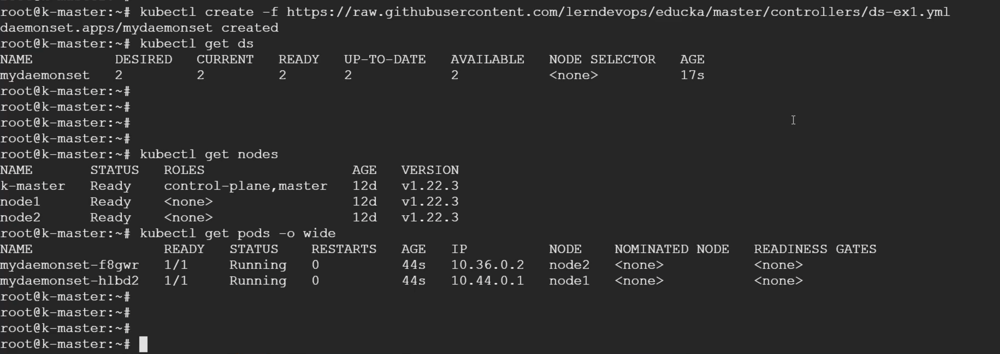

# ReplicationController
> A ReplicationController ensures that a specified number of pod replicas are running at any one time. In other words, a ReplicationController makes sure that a pod or a homogeneous set of pods is always up and available.
## How a ReplicationController Works
https://kubernetes.io/docs/concepts/workloads/controllers/replicationcontroller/

# ReplicaSet
> A ReplicaSet's purpose is to maintain a stable set of replica Pods running at any given time. As such, it is often used to guarantee the availability of a specified number of identical Pods.

## How a ReplicaSet works
https://kubernetes.io/docs/concepts/workloads/controllers/replicaset/#how-a-replicaset-works

# Deployment 

> A Deployment provides declarative updates for Pods and ReplicaSets.You describe a desired state in a Deployment, and the Deployment Controller changes the actual state to the desired state at a controlled rate. You can define Deployments to create new ReplicaSets, or to remove existing Deployments and adopt all their resources with new Deployments.

##### Rollingupadtes&rollbacks 

> commands 
kubectl set image deployment kubeserve app=leaddevops/kubeserve:v1  --record=true 
kubectl rollout undo deployment kubeserve --to-revision=2
kubectl rollout resume deployment/kubeserve
kubectl rollout undo deployment kubeserve --to-revision=2
kubectl rollout status deployment kubeserve
kubectl rollout history deploy kubeserve

## Use Case
https://kubernetes.io/docs/concepts/workloads/controllers/deployment/

# Daemonset
> A DaemonSet ensures that all (or some) Nodes run a copy of a Pod. As nodes are added to the cluster, Pods are added to them. As nodes are removed from the cluster, those Pods are garbage collected. Deleting a DaemonSet will clean up the Pods it created.

Some typical uses of a DaemonSet are:

running a cluster storage daemon on every node
running a logs collection daemon on every node
running a node monitoring daemon on every node

> commands

https://kubernetes.io/docs/concepts/workloads/controllers/daemonset/

## Jobs
>A Job creates one or more Pods and will continue to retry execution of the Pods until a specified number of them successfully terminate. As pods successfully complete, the Job tracks the successful completions. When a specified number of successful completions is reached, the task (ie, Job) is complete. Deleting a Job will clean up the Pods it created. Suspending a Job will delete its active Pods until the Job is resumed again.

https://kubernetes.io/docs/concepts/workloads/controllers/job/

## Cronjobs
> CronJobs are meant for performing regular scheduled actions such as backups, report generation, and so on. Each of those tasks should be configured to recur indefinitely (for example: once a day / week / month); you can define the point in time within that interval when the job should start.

https://kubernetes.io/docs/concepts/workloads/controllers/cron-jobs/

https://learning.edureka.co/classroom/recording/922/8407/1492629?tab=ClassRecording

