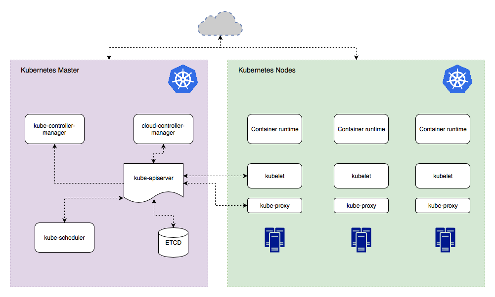

## What Is Kubernetes?

Kubernetes (K8s in short) is an open-source container orchestration platform introduced by Google in 2014. It is a successor of Borg, Google’s in-house orchestration system that accumulated over a decade of the tech giant’s experience of running large enterprise workloads in production. In 2014, Google decided to further container ecosystem by sharing Kubernetes with the cloud native community. Kubernetes became the first graduated project of the newly created Cloud Native Community Foundation (CNCF), an organization conceived by Google and the Linux Foundation as the main driver of the emerging cloud native movement.

## what’s the deal with Kubernetes ?
The platform’s main purpose is to automate deployment and management (e.g., update, scaling, security, networking) of containerized application in large distributed computer clusters. To this end, the platform offers a number of API primitives, deployment options, networking, container and storage interfaces, built-in security, and other useful features.

## what a basic process of running applications in Kubernetes looks like.

First, you package your application with all its dependencies into a Linux container (for example, with Docker).

Then, you create an API resource in Kubernetes where you specify the container image to use, the number of replicas to run, ports, volumes, update policy, configuration, and other parameters.

Third, you register the API object with the Kubernetes API server.

Thereafter, Kubernetes works to maintain the desired state of the API resource you declared. For example, it tries to run the number of replicas you specified, re-schedule the app onto another node if the one hosting it failed, perform liveness and readiness probes, etc.

In sum, Kubernetes provides a way to maintain the desired state of your application. With this platform, you declare how you want your app to be run and Kubernetes takes care of it. Kubernetes also allows administrators to efficiently manage cluster resources both on-premises and in the cloud.

# Kubernetes Architecture

A Kubernetes master runs Control Plane responsible for maintaining the desired state of the cluster we discussed above. In its turn, the Kubernetes Control Plane consists of several components with unique roles (see the image below):

## Master Components Description

> Etcd	--- is a data store used by Kubernetes to store all information about the cluster. It’s critical for keeping everything up to date

> kube-apiserver --- Exposes Kubernetes API to users allowing them to create API resources, run applications, and configure various parameters of the cluster.

> kube-controller-manager ---- Manages API objects created by users. It makes sure that the actual state of the cluster always matches the desired state. This

> kube-scheduler -------- Responsible for scheduling user workloads on the right infrastructure. When scheduling applications, kube-scheduler considers various factors such as available node resources, node health, and availability, as well as user-defined constraints.

> cloud-controller-manager --- Embraces various controllers, all of which interact with the cloud providers’ APIs.

## Worker components Description

> kubelet ---Applications deployed by users usually run on non-master nodes. These nodes communicate with the master via , a central node component that performs many orchestration tasks such as registering nodes with the API server, starting and killing containers, monitoring containers, executing liveness probes, collecting container and node metrics, etc.

> kube-proxy -----reflects Kubernetes networking services on each node.

> CRI - container Runtime interface

https://kubernetes.io/docs/concepts/overview/components/

https://github.com/lerndevops/educka

