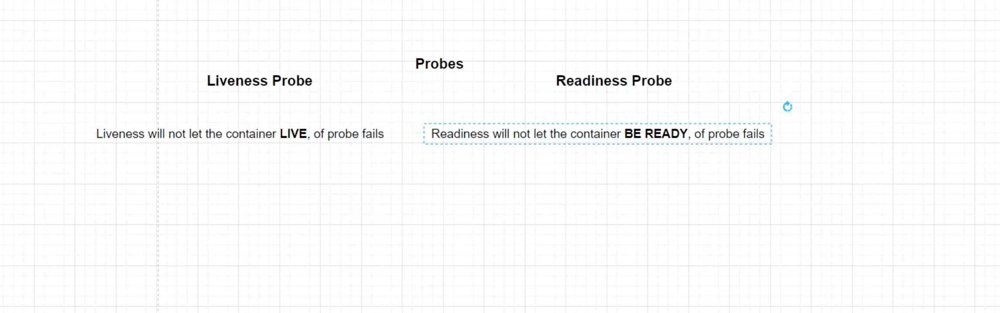

# Kubernetes Liveness and Readiness Probes

### Liveness

> Kubernetes uses liveness probes to know when to restart a container. If a container is unresponsive—perhaps the application is deadlocked due to a multi-threading defect—restarting the container can make the application more available, despite the defect. It certainly beats paging someone in the middle of the night to restart a container.

### Readiness Probes

> Kubernetes uses readiness probes to decide when the container is available for accepting traffic. The readiness probe is used to control which pods are used as the backends for a service. A pod is considered ready when all of its containers are ready. If a pod is not ready, it is removed from service load balancers. For example, if a container loads a large cache at startup and takes minutes to start, you do not want to send requests to this container until it is ready, or the requests will fail—you want to route requests to other pods, which are capable of servicing requests.

https://kubernetes.io/docs/tasks/configure-pod-container/configure-liveness-readiness-startup-probes/

https://github.com/lerndevops/educka/tree/master/pods/probes

https://blog.colinbreck.com/kubernetes-liveness-and-readiness-probes-how-to-avoid-shooting-yourself-in-the-foot/

https://learning.edureka.co/classroom/recording/922/8407/1492629?tab=ClassRecording

