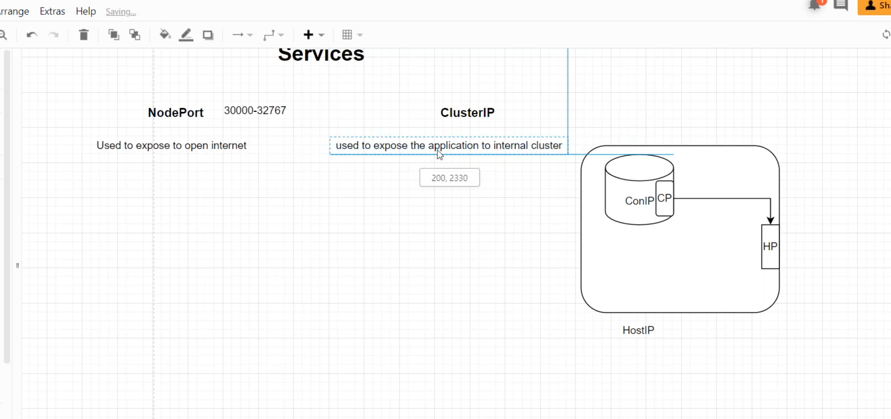

#### ClusterIP 
> ClusterIP provides a load-balanced IP address. One or more pods that match a label selector can forward traffic to the IP address. The ClusterIP service must define one or more ports to listen on with target ports to forward TCP/UDP traffic to containers.

#### Nodeport 

> A NodePort service is the most primitive way to get external traffic directly to your service. NodePort, as the name implies, opens a specific port on all the Nodes (the VMs), and any traffic that is sent to this port is forwarded to the service.

https://github.com/lerndevops/educka/blob/master/services-networks/clusterip-svc.yml